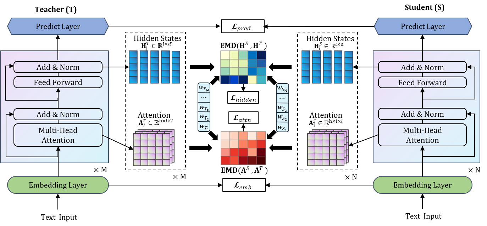

# BERT-EMD
This repository contains an implementation with PyTorch of model presented in the paper "BERT-EMD: Many-to-Many Layer Mapping for BERT Compression with Earth Mover's Distance" in EMNLP 2020.
The figure below illustrates a high-level view of the model's architecture.

For more details about the techniques of BERT-EMD, refer to our paper:[update soon]

### Installation

Run command below to install the environment (using python3).

```
pip install -r requirements.txt 
```

### Data and Pre-train Model Prepare

1. Get GLUE data:
```
python download_glue_data.py --data_dir glue_data --tasks all
```
2. Get BERT-Base offical model from [here](https://storage.googleapis.com/bert_models/2020_02_20/uncased_L-12_H-768_A-12.zip), download and unzip to directory  `./model/bert_base_uncased`. Convert tf model to pytorch model:
```
cd bert_finetune
python convert_bert_original_tf_checkpoint_to_pytorch.py \
--tf_checkpoint_path ../model/bert_base_uncased \
--bert_config_file ../model/bert_base_uncased/bert_config.json \
--pytorch_dump_path ../model/pytorch_bert_base_uncased
``` 
Or you can download the pytorch version directly from [huggingface](https://huggingface.co/bert-base-uncased#).

3. Get finetune teacher model, take task QQP for example:
```

export MODEL_PATH=../model/pytorch_bert_base_uncased/
export TASK_NAME=QQP
python run_glue.py \
  --model_type bert \
  --model_name_or_path $MODEL_PATH \
  --task_name $TASK_NAME \
  --do_train \
  --do_eval \
  --do_lower_case \
  --data_dir ../data/glue_data/$TASK_NAME/ \
  --max_seq_length 128 \
  --per_gpu_train_batch_size 32 \
  --learning_rate 2e-5 \
  --num_train_epochs 4.0 \
  --save_steps 2000 \
  --output_dir ../model/$TASK_NAME/teacher/ \
  --evaluate_during_training \
  --overwrite_output_dir
```
4. Get the pretrained general distillation TinyBERT student model: [4-layer](https://drive.google.com/open?id=1PhI73thKoLU2iliasJmlQXBav3v33-8z) and [6-layer](https://drive.google.com/open?id=1r2bmEsQe4jUBrzJknnNaBJQDgiRKmQjF).
Unzip to directory  `model/student/layer4` and  `model/student/layer6` respectively.
5. Distill student model, take 4-layer student model for example:
```
cd bert_emd
export TASK_NAME=QQP
python emd_task_distill.py  \
--data_dir ../glue_data/$TASK_NAME/ \
--teacher_model ../model/$TASK_NAME/teacher/ \
--student_model ../model/student/layer4/ \
--task_name $TASK_NAME \
--output_dir ../model/$TASK_NAME/student/ \
--beta 0.01 --theta 1
```


### update 2021/08/06
We replace the layer weight update method with division by addition. In our experiments, this normalization method is better than softmax on some datasets.
